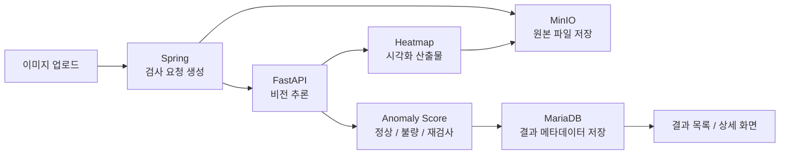

# Industrial AI Platform

산업 설비와 품목 점검을 지원하는 **웹 기반 이상 탐지 플랫폼**입니다.

이미지 기반 비전 이상 탐지 결과와 설비 문서 RAG, LLM 요약을 결합해 작업자에게 **판정 근거, 대응 절차, 점검 이력, 참고 출처**를 제공합니다.

```text
이미지 검사 → AI 이상 탐지 → 결과 저장 → 문서 RAG 검색 → LLM 기반 대응 가이드 제공

```

## 목차

1. [프로젝트 목적](#1-프로젝트-목적)
2. [시연 동영상](#2-시연-동영상)
3. [웹사이트 링크](#3-웹사이트-링크)
4. [현재 MVP 구현 범위](#4-현재-mvp-구현-범위)
5. [주요 기능](#5-주요-기능)
6. [시스템 구성](#6-시스템-구성)
7. [기술 스택](#7-기술-스택)
8. [시스템 아키텍처](#8-시스템-아키텍처)
9. [프로젝트 구조](#9-프로젝트-구조)
10. [주요 화면](#10-주요-화면)
11. [실행 방법](#11-실행-방법)
12. [로컬 접속 정보 / 포트](#12-로컬-접속-정보--포트)
13. [실행 확인 체크리스트](#13-실행-확인-체크리스트)
14. [API 개요](#14-api-개요)
15. [AI / RAG 파이프라인 개요](#15-ai--rag-파이프라인-개요)
16. [문서 지도](#16-문서-지도)
17. [협업 및 개발 컨벤션](#17-협업-및-개발-컨벤션)
18. [참고 / 부록](#18-참고--부록)

---

## 1. 프로젝트 목적

🎯 산업 현장에서 발생하는 **설비 이상, 품목 결함, 점검 이슈**를 웹 기반으로 관리하기 위한 MVP입니다.

본 프로젝트는 단순히 이미지를 업로드하고 정상/불량을 판정하는 데서 끝나지 않고, 검사 결과와 관련 설비 문서를 함께 활용해 작업자가 다음 조치를 판단할 수 있도록 지원하는 것을 목표로 합니다.

| 핵심 목표 | 설명 |
| --- | --- |
| 비전 이상 탐지 | 이미지 기반으로 정상 / 불량 / 재검사 여부를 판정합니다. |
| 결과 이력 관리 | 검사 요청, 결과, 점수, 재검토 상태를 저장하고 조회합니다. |
| 문서 기반 대응 | 설비 매뉴얼과 점검 기준서를 RAG로 검색합니다. |
| LLM 요약 | 검색된 출처를 기반으로 작업자용 대응 가이드를 생성합니다. |
| 권한 분리 | 일반 사용자와 시스템 관리자 기능을 분리합니다. |

---

## 2. 시연 동영상

🎬 <!-- TODO: 시연 동영상 링크 추가 -->

시연 동영상은 추후 추가 예정입니다.

---

## 3. 웹사이트 링크

- 🌐 서비스 URL: https://industrial-ai.ddns.net/

서버가 꺼져 있으면 접속이 제한될 수 있습니다.  
접속이 필요한 경우 담당자에게 문의해 주세요.

- 문의: bonggyulim0728@gmail.com

---

## 4. 현재 MVP 구현 범위

| 구분 | 내용 |
| --- | --- |
| MVP 중심 범위 | 이미지 업로드 검사, 브라우저 카메라 단건 캡처 검사, 검사 결과 목록/상세 조회, 문서 업로드, 문서 인덱싱, RAG 기반 챗봇, 대시보드, 운영 모니터링 |
| 기반 구조 포함 | 모델 버전 관리, 모델 배포 관리, 문서 버전 관리, 검사 이력 관리, 알림/보고서 확장 기반 |
| 부분 구현 / 검증 필요 | 실제 설비별 모델 품질 검증, RAG 문서 품질 평가, 관리자 운영 플로우 E2E 검증, 운영 환경 배포 자동화 |
| 향후 확장 | 영상 파일 분석, 카메라 영상 연속 분석, 설비 신호 연동, 이메일/메신저 알림, 검사 보고서 자동 생성, 시스템 상태 모니터링 강화, 여러 회사 동시 운영 지원 |

브라우저 카메라 화면에서 현재 프레임 1장을 캡처해 이미지 검사 요청으로 처리하는 방식입니다.

세부 기능 정의와 우선순위는 [기능 정의서](docs/project/기능정의.md)와 [정책 정의서](docs/project/정책정의.md)를 기준으로 관리합니다.

---

## 5. 주요 기능

### 1. 이상 탐지

- 이미지 파일 업로드 기반 검사 요청
- 브라우저 카메라 단건 캡처 검사
- AI 추론 결과 저장
- 정상 / 불량 / 재검사 판정
- anomaly score 제공
- heatmap, anomaly map 등 시각화 산출물 제공
- 검사 결과 목록 및 상세 조회

### 2. 설비 점검 지원

- 설비 문서 업로드
- 문서 버전 관리
- 문서 인덱싱 상태 관리
- RAG 기반 문서 검색
- 출처 기반 LLM 답변 생성
- 검사 결과 문맥 기반 대응 가이드 제공

### 3. 운영 관리

- 대시보드 지표 조회
- 검사 이력 관리
- 재검토 큐 관리
- 모델 버전 관리
- 모델 배포 상태 관리
- 시스템 컴포넌트 상태 모니터링
- 운영 로그 및 감사 로그 관리

### 4. 사용자 / 권한 관리

- 이메일 또는 OAuth 기반 로그인
- 회원가입 신청 및 관리자 승인
- 일반 사용자 / 관리자 권한 분리
- 사용자별 설정 및 임계값 관리
- 관리자 전용 운영 기능 보호

---

## 6. 시스템 구성

### 🧱 모듈 역할

| 모듈 | 역할 |
| --- | --- |
| `frontend` | React 기반 사용자 화면 |
| `backend-spring` | 인증/인가, 검사 요청, 결과 관리, 문서 관리, 관리자 API |
| `ai-server` | 이상 탐지 추론, 문서 인덱싱, RAG 검색, LLM 응답 처리 |
| `infra` | MariaDB, Redis, MinIO, ChromaDB, Nginx, Docker Compose |
| `docs` | 기능 정의, 정책, API, ERD, 개발환경, 컨벤션 문서 |
| `.github` | GitHub Actions 워크플로우 |

### 저장소 역할

| 저장소 | 역할 |
| --- | --- |
| MariaDB | 사용자, 검사, 결과, 문서 메타데이터, 모델 버전, 운영 로그 저장 |
| MinIO | 원본 이미지, 시각화 결과, 문서 파일, 보고서, 모델 산출물 저장 |
| ChromaDB | RAG 문서 chunk vector 저장 |
| Redis | 세션, 캐시, 작업 상태 관리 |
| File System / Docker Volume | 로컬 개발용 인프라 데이터 유지 |

---

## 7. 기술 스택

| 영역 | 기술 |
| --- | --- |
| Frontend |       |
| Spring Backend |        |
| FastAPI AI Server |          
| Data / Infra |       |
| DevOps |    |

세부 버전은 [개발환경 설정](docs/project/개발환경.md)을 기준으로 관리합니다.

후속 연결 또는 환경 의존 항목:

- LLM 런타임은 `ai-server/.env.example` 기준으로 설정합니다.
- 외부 알림, 자동 보고서, 고급 모니터링은 확장 예정 범위입니다.
- 모델 아티팩트와 대용량 파일은 Git에 직접 커밋하지 않습니다.

---

## 8. 시스템 아키텍처

<div align="center">
  
</div>

 🏗️ 본 프로젝트는 **Frontend - Nginx - Spring Backend - FastAPI AI Server - 데이터/인프라 계층**으로 구성됩니다.

- **Frontend**는 사용자 화면을 제공하며, 대시보드, 검사 요청, 결과 조회, 문서/RAG, 사용자/설정 관리 기능을 담당합니다.
- **Nginx**는 리버스 프록시 역할을 수행하며, 정적 파일과 API 요청을 각각 적절한 서버로 라우팅합니다.
- **Spring Backend**는 인증/인가, 사용자/조직/설정 관리, 검사 요청 및 결과 관리, 문서/배포 관리, 챗봇 요청 중계를 담당하는 메인 API 서버입니다.
- **FastAPI AI Server**는 비전 모델 추론, 입력 품질 검사, 이상 탐지 결과 생성, 문서 임베딩/검색(RAG), LLM 응답 생성을 담당합니다.
- **데이터/인프라 계층**은 MariaDB, Redis, MinIO, ChromaDB, LLM Provider로 구성되며, 각각 메타데이터 저장, 캐시/세션/큐, 파일 저장, 벡터 검색, 답변 생성을 담당합니다.

### 주요 요청 흐름

1. 사용자는 Frontend에서 검사 요청 또는 문서/RAG 요청을 보냅니다.
2. 요청은 Nginx를 거쳐 Spring Backend로 전달됩니다.
3. Spring Backend는 비즈니스 로직과 권한 검사를 처리합니다.
4. AI 추론 또는 RAG 처리가 필요한 경우 FastAPI AI Server로 내부 REST API 요청을 전달합니다.
5. 결과는 MariaDB, Redis, MinIO, ChromaDB 등에 저장되며 최종적으로 Frontend에 반환됩니다.

---

## 9. 프로젝트 구조

```text
industrial-ai-platform/
  frontend/             React + Vite 클라이언트
  backend-spring/       Spring Boot 메인 API 서버
  ai-server/            FastAPI AI/RAG 서버
  infra/                Docker Compose, Nginx, MariaDB 초기화, 운영 스크립트
  docs/                 기능/정책/API/ERD/환경/컨벤션 문서
  .github/              GitHub Actions 워크플로우
```

📁 세부 디렉터리 원칙은 [디렉터리 구조](docs/project/디렉터리구조.md)를 참고합니다.

---

## 10. 주요 화면

🖼️ <!-- TODO: 주요 화면 스크린샷 추가 -->

| 화면 | 목적 |
| --- | --- |
| 로그인 / 회원가입 | 사용자 인증과 신규 계정 승인 요청을 처리합니다. |
| 대시보드 | 검사 현황, 최근 결과, 주요 운영 지표를 요약합니다. |
| 업로드 탐지 | 이미지 파일을 업로드해 이상 탐지 검사를 요청합니다. |
| 실시간 검사 진입 | 브라우저 카메라 프리뷰에서 현재 프레임 1장을 캡처해 검사합니다. |
| 결과 목록 / 상세 | 판정, 점수, 시각화 결과, 모델 정보, 재검토 상태를 확인합니다. |
| 문서 목록 / 등록 / 수정 | 설비 문서를 관리하고 인덱싱 상태를 확인합니다. |
| 챗봇 / RAG 질의응답 | 문서 출처를 기반으로 점검 및 대응 가이드를 제공합니다. |
| 알림 / 마이페이지 / 설정 | 사용자 알림, 개인 정보, 기본 설정을 관리합니다. |
| 관리자 운영 모니터링 | 시스템 상태, 비동기 작업, 운영 로그를 확인합니다. |

화면 목록과 와이어프레임은 [페이지 목록](docs/project/페이지목록.md)과 `docs/project/wireframes/`를 참고합니다.

---

## 11. 실행 방법

▶️ 아래 절차는 Windows PowerShell 기준 로컬 개발 실행 순서입니다.

### 1. 필수 도구 준비

- JDK 17
- Node.js 20 권장
- Python 3.10.6
- Docker Desktop 또는 Docker Engine
- Git

### 2. 환경 변수 파일 생성

```powershell
Copy-Item .\infra\.env.example .\infra\.env
Copy-Item .\backend-spring\.env.example .\backend-spring\.env
Copy-Item .\frontend\.env.example .\frontend\.env
Copy-Item .\ai-server\.env.example .\ai-server\.env
```

실제 비밀번호, 토큰, API Key, OAuth Secret, JWT Secret은 `.env`에만 작성하고 Git에 커밋하지 않습니다.  
공유가 필요한 설정은 실제 값이 없는 `.env.example`에만 반영합니다.

### 3. 인프라 실행 및 DB 초기화

```powershell
cd .\infra
docker compose --env-file .env up -d
.\scripts\db-migrate.ps1
.\scripts\db-seed.ps1
docker compose ps
cd ..
```

로컬 DB를 완전히 재생성해야 할 때만 아래 명령을 사용합니다.

```powershell
cd .\infra
.\scripts\db-reset.ps1 -Force
cd ..
```

### 4. FastAPI AI Server 실행

```powershell
cd .\ai-server
python -m venv .venv
.\.venv\Scripts\Activate.ps1
pip install -r requirements.txt
uvicorn main:app --reload --host 0.0.0.0 --port 8001
```

### 5. Spring Backend 실행

```powershell
cd .\backend-spring
.\gradlew.bat bootRun --args="--spring.profiles.active=local"
```

### 6. Frontend 실행

```powershell
cd .\frontend
npm install
npm run dev
```

운영용 Docker fullstack 실행은 [운영 compose 가이드](docs/project/docker-compose-prod.md)와 [Infra README](infra/README.md)를 참고합니다.

---

## 12. 로컬 접속 정보 / 포트

🔌로컬 개발 기준 포트입니다. 값은 `.env.example`, `docker-compose.yml`, 모듈 설정 파일을 기준으로 확인합니다.

| 대상 | 로컬 주소 | 비고 |
| --- | --- | --- |
| Nginx Gateway | `http://localhost` 또는 `http://localhost:80` | `/`는 Frontend, `/api/`는 Spring으로 프록시 |
| Frontend | `http://localhost:5173` | Vite dev server |
| Spring API | `http://localhost:8080/api/v1` | health: `/api/v1/health` |
| FastAPI AI Server | `http://localhost:8001` | health: `/ai/v1/health` |
| MinIO API | `http://localhost:9000` | 내부 파일 저장소 |
| MinIO Console | `http://localhost:9001` | 로컬 관리 콘솔 |
| ChromaDB | `http://localhost:8000` | vector DB |
| MariaDB | `localhost:3307` | DB name 기본값: `industrial_ai` |
| Redis | `localhost:6379` | 세션/캐시/작업 상태 |

상세 포트 기준은 [포트 정리](docs/project/포트정리.md)를 참고합니다.

---

## 13. 실행 확인 체크리스트

- [ ] `infra`에서 `docker compose --env-file .env up -d` 실행
- [ ] `docker compose ps`로 MariaDB, Redis, MinIO, ChromaDB 상태 확인
- [ ] `http://localhost:8080/api/v1/health`로 Spring health check 확인
- [ ] `http://localhost:8001/ai/v1/health`로 FastAPI health check 확인
- [ ] `http://localhost:5173` 또는 `http://localhost`로 Frontend 접속 확인
- [ ] 팀 테스트 가이드의 계정/시드 기준으로 로그인 가능 여부 확인
- [ ] 이미지 업로드 검사 요청 후 결과가 `PROCESSING -> COMPLETED/FAILED`로 전이되는지 확인
- [ ] 문서 업로드 후 인덱싱 상태가 `대기 / 처리중 / 반영완료 / 반영실패` 중 하나로 표시되는지 확인
- [ ] RAG 챗봇에서 출처 기반 답변이 반환되는지 확인

✅ 상세 검증 절차는 [테스트 실행 가이드](docs/project/테스트실행가이드.md)와 [팀 테스트 가이드](docs/project/team-test-guide.md)를 참고합니다.

---

## 14. API 개요

🔗 외부 API 기본 prefix는 `/api/v1`입니다.

| 구분 | 예시 기능 |
| --- | --- |
| 인증 / 사용자 | 로그인, 로그아웃, 토큰 갱신, 내 정보, 회원가입 신청 |
| 검사 | 이미지 업로드 검사, 검사 상태 조회, 검사 실행 상세 조회 |
| 결과 | 결과 목록 조회, 결과 상세 조회, 결과 이미지/산출물 조회 |
| 문서 | 문서 업로드, 문서 수정, 문서 버전 관리, 인덱싱 요청 |
| RAG / 챗봇 | 대화 생성, 질문 전송, 답변 출처 조회 |
| 관리자 | 가입 승인, 재검토 처리, 운영 모니터링, 감사 로그 조회 |
| 모델 관리 | 모델 등록, 모델 버전 관리, 모델 배포 관리 |

성공 응답은 기본적으로 아래 형식을 따릅니다.

```json
{
  "success": true,
  "data": {},
  "message": "요청이 성공적으로 처리되었습니다."
}
```

오류 응답은 RFC 9457 Problem Details 형식을 따릅니다.

상세 엔드포인트, 요청/응답, 권한 기준은 [API 명세서](docs/project/API.md)를 참고합니다.

---

## 15. AI / 챗봇 파이프라인 개요

### 🤖 이상 탐지 파이프라인



### 챗봇 파이프라인
<div align="center">
  
</div>


챗봇 답변은 조직 범위 문서 기반으로 생성합니다.  
관련 문서가 없거나 질문이 범위를 벗어난 경우 임의 답변을 생성하지 않고 제한 응답을 제공합니다.

답변에는 가능한 경우 다음 출처 정보를 함께 제공합니다.

- 문서명
- 문서 버전
- section
- page
- chunk
- score
- source snippet

AI 서버의 세부 구조와 실행 방법은 [AI Server README](ai-server/README.md)를 참고합니다.

---

## 16. 문서 지도

| 문서 | 위치 |
| --- | --- |
| 프로젝트 개요 | [docs/project/프로젝트개요.md](docs/project/프로젝트개요.md) |
| 기능 정의서 | [docs/project/기능정의.md](docs/project/기능정의.md) |
| 정책 정의서 | [docs/project/정책정의.md](docs/project/정책정의.md) |
| API 명세서 | [docs/project/API.md](docs/project/API.md) |
| ERD | [docs/project/ERD.md](docs/project/ERD.md) |
| 디렉터리 구조 | [docs/project/디렉터리구조.md](docs/project/디렉터리구조.md) |
| 개발환경 설정 | [docs/project/개발환경.md](docs/project/개발환경.md) |
| 컨벤션 | [docs/project/컨벤션.md](docs/project/컨벤션.md) |
| 테스트 실행 가이드 | [docs/project/테스트실행가이드.md](docs/project/테스트실행가이드.md) |
| 팀 테스트 가이드 | [docs/project/team-test-guide.md](docs/project/team-test-guide.md) |
| 운영 Docker Compose | [docs/project/docker-compose-prod.md](docs/project/docker-compose-prod.md) |
| 포트 정리 | [docs/project/포트정리.md](docs/project/포트정리.md) |
| 권한 매트릭스 | [docs/auth/api-authority-matrix.md](docs/auth/api-authority-matrix.md) |
| DB 초기화 | [docs/db/mariadb-schema-init.md](docs/db/mariadb-schema-init.md) |

---

## 17. 협업 및 개발 컨벤션

- 브랜치 전략은 `main`, `develop`, `feat/*`, `fix/*`, `docs/*`, `chore/*`를 기준으로 합니다.
- 커밋 메시지는 `type: 작업 내용` 형식을 사용합니다.
- PR은 기능 단위로 생성하고, 변경 내용과 테스트 결과를 본문에 정리합니다.
- Frontend는 FSD 구조를 따르고 API 호출은 `shared/api` 또는 feature API 계층에 둡니다.
- Spring은 Hexagonal Architecture 기준으로 Controller, UseCase, Port, Adapter 책임을 분리합니다.
- FastAPI는 Router, Application, Domain, Infrastructure, Container 계층을 분리합니다.
- API 계약 변경은 문서, DTO, 요청/응답 영향도를 먼저 확인한 뒤 반영합니다.
- `.env`, `.env.*`, 인증서, API Key, DB 비밀번호, Google OAuth Client Secret, JWT Secret은 Git에 커밋하지 않습니다.
- 모델 대용량 파일(`*.pt`, `*.onnx`, `*.ckpt`)은 Git에 커밋하지 않습니다.
- 공유가 필요한 설정은 실제 값이 없는 `.env.example`에만 반영합니다.

🤝 상세 규칙은 [컨벤션 문서](docs/project/컨벤션.md)를 참고합니다.

---

## 18. 참고 / 부록

- [Frontend README](frontend/README.md)
- [Backend Spring README](backend-spring/README.md)
- [AI Server README](ai-server/README.md)
- [Infra README](infra/README.md)
- [Docs Index](docs/README.md)

📎 운영 배포 전에는 다음 항목을 확인합니다.

- `git status`
- 변경 파일 목록
- 환경 변수 템플릿
- DB 마이그레이션
- Docker Compose 설정
- 민감정보 포함 여부
- 대용량 모델 파일 포함 여부
